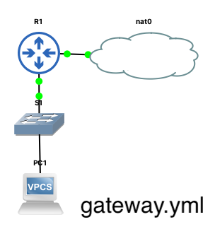
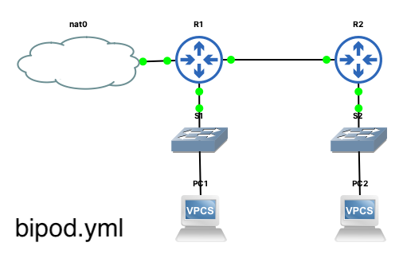
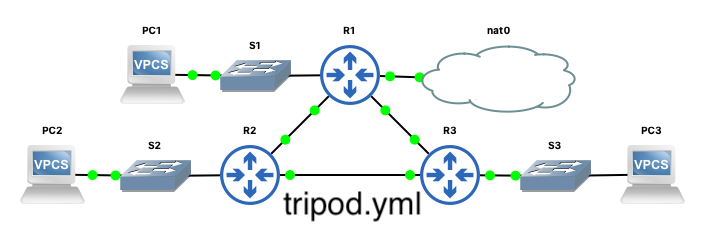
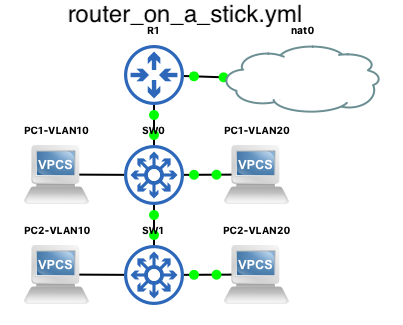
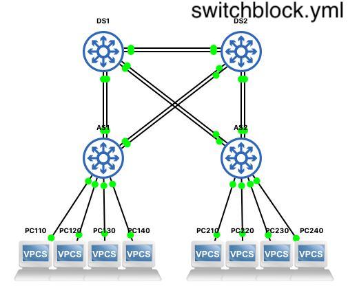
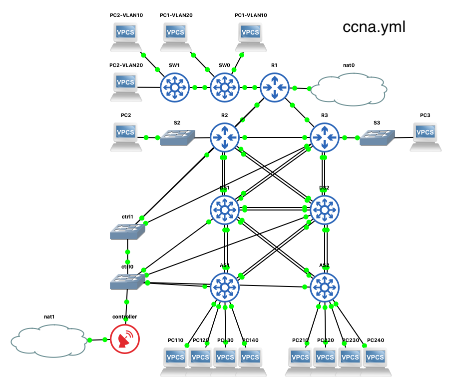
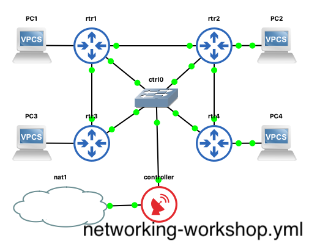

# Ansible CCNA Lab

<!-- TOC depthFrom:2 depthTo:6 withLinks:1 updateOnSave:1 orderedList:0 -->

- [1. Description du projet](#1-description-du-projet)
- [2. La gestion du réseau avec Ansible](#2-la-gestion-du-rseau-avec-ansible)
- [3. La mise en place du lab sur GNS3](#3-la-mise-en-place-du-lab-sur-gns3)
	- [3.1. Setup du lab GNS3 avec Ansible](#31-setup-du-lab-gns3-avec-ansible)
	- [3.2. Configuration de la station de contrôle](#32-configuration-de-la-station-de-contrle)
	- [3.3. Préparation des images Cisco IOSv pour GNS3](#33-prparation-des-images-cisco-iosv-pour-gns3)
		- [3.3.1. Les Routeurs IOSv](#331-les-routeurs-iosv)
		- [3.3.2. Commutateurs IOSv](#332-commutateurs-iosv)
	- [3.4. Récupérer le dépôt des livres de jeu Ansible](#34-rcuprer-le-dpt-des-livres-de-jeu-ansible)
	- [3.5. Prise de connaissance des paramètres de configuration de Ansible](#35-prise-de-connaissance-des-paramtres-de-configuration-de-ansible)
- [4. Les topologies CCNA](#4-les-topologies-ccna)
	- [4.1. Topologie CCNA Gateway](#41-topologie-ccna-gateway)
	- [4.2. Topologie CCNA Bipod](#42-topologie-ccna-bipod)
	- [4.3. Topologie CCNA Tripod](#43-topologie-ccna-tripod)
		- [4.3.1. Topologie logique](#431-topologie-logique)
		- [4.3.2. Brève description](#432-brve-description)
	- [4.4. Topologie variante Router on a Stick](#44-topologie-variante-router-on-a-stick)
	- [4.5. Topologie CCNA Switchblock](#45-topologie-ccna-switchblock)
		- [4.5.1. Topologie avec redondance de passerelle HSRP](#451-topologie-avec-redondance-de-passerelle-hsrp)
		- [4.5.2. VLANs](#452-vlans)
		- [4.5.3. Ports Etherchannel et Trunk VLANs](#453-ports-etherchannel-et-trunk-vlans)
		- [4.5.4. Spanning-Tree](#454-spanning-tree)
		- [4.5.5. Plan d'adressage](#455-plan-dadressage)
		- [4.5.6. HSRP](#456-hsrp)
		- [4.5.7. Ressources requises](#457-ressources-requises)
		- [4.5.8. Explication](#458-explication)
	- [4.6. Toplogie CCNA Tripod et Switchblock](#46-toplogie-ccna-tripod-et-switchblock)
	- [4.7. Topologie Ansible Networking Workshop](#47-topologie-ansible-networking-workshop)
- [5. L'utilisation des livres de jeu](#5-lutilisation-des-livres-de-jeu)
	- [5.1. Inventaire et variables d'inventaire du livre de jeu ccna.yml](#51-inventaire-et-variables-dinventaire-du-livre-de-jeu-ccnayml)
	- [5.2. Livres de jeu](#52-livres-de-jeu)
	- [5.3. Les rôles invoqués](#53-les-rles-invoqus)
	- [5.4. Diagnostic de base](#54-diagnostic-de-base)
	- [5.5. Remettre à zéro les configurations](#55-remettre-zro-les-configurations)
- [6. Notes](#6-notes)
	- [6.1. Comment rendre une tâche ios_config idempotente ?](#61-comment-rendre-une-tche-iosconfig-idempotente-)
	- [6.2. Phase I : roles ios_config](#62-phase-i-roles-iosconfig)
	- [6.3. Phase II : immutabilité](#63-phase-ii-immutabilit)
	- [6.4. Phase III : Reporting et documentation](#64-phase-iii-reporting-et-documentation)

<!-- /TOC -->


## 1. Description du projet

On trouvera ici des livres de jeu Ansible inspirés des topologies et des sujets du Cisco CCNA (et plus) pour GNS3 (Cisco IOSv). Sa documentation devrait bientôt être disponible sur [https://goffinet.github.io/ansible-ccna-lab/](https://goffinet.github.io/ansible-ccna-lab/). Le projet permet de créer des topologies avec GNS3, de les approvisionner et, ensuite, de les gérer avec Ansible avec pour seul objet du code reproductible et manipulable à l'envi.

Leur but est **uniquement pédagogique** visant à lier les compétences de gestion du réseau du CCNA/CCNP avec un outil IaC ("Infrastructure as Code") de gestion des configurations ("Configuration Management") comme Ansible et un gestionnaire de source ("Source Control Management") comme Git/Github. Le projet tente de répondre à la question suivante : Comment porter les labs de formation d'infrastructure IT (Cisco) sous forme de code ?

Il s'agit aussi pour le formateur et pour les stagiaires d'avoir sous la main un outil souple pour créer et gérer des scénarios de labs qui demandent une préconfiguration ou des changements de configuration (afin de créer des erreurs à corriger manuellement par exemple, développer des projets plus complexes, observer des situations, compléter des configurations, mettre en place des modifications, etc.).

Dans les points suivants nous détaillerons :

- La gestion du réseau avec Ansible
- La mise en place du lab sous GNS3
- Les topologies
- L'utilisation des livres de jeu
- Des notes et un roadmap du projet

## 2. La gestion du réseau avec Ansible

Pour la gestion des noeuds Cisco, le projet est basé sur trois éléments : des livres de jeu qui peuvent en appeler d'autres nommés selon la **topologie** ; ces livres de jeu configurent des hôtes d'inventaire avec des tâches organisées en **rôles** ; les paramètres de la topologie sont configurés en tant que **variables d'inventaire selon un certain modèle de données**.

Les topologies sont organisées de la manière suivante :

```yaml
ccna:
  tripod:
    gateway:
    bipod:
    router_on_a_stick:
  switchblock:
```

Une topologie intitulée "ccna" est composée de deux topologies distinctes "tripod" et "switchblock". La topologie "tripod" trouve trois variantes amoindries : "gateway", "bipod", et "router_on_a_stick".

Expliqué rapidement :

* Le livre de jeu `ccna.yml` utilise l'inventaire par défaut `ccna` (`tripod` + `switchblock`). On trouve d'autres inventaires adaptés aux livres de jeu du même nom dans le dossier `inventories/`.
* Un livre le jeu devrait appeler un inventaire du même nom, par exemple : `ansible-playbook -i inventories/tripod/hosts tripod.yml`.
* On peut contrôler les tâches avec des _tags_ (définis sur les rôles) : `ansible-playbook ccna.yml --list-tags`.
* L'exécution des tâches est conditionnée par le modèle de donnée (variables d'inventaire), principalement fondé sur une liste de paramètres d'interface.
* L'exécution des rôles est conditionnée par :
  * une variable `ansible_network_os == 'ios'`;
  * la définition d'une variable de telle sorte que l'absence de paramètre évite l'exécution des tâches ("Skipped").
* Le protocole de routage est contrôlé à partir du livre de jeu avec les variables `ipv4.routing` et `ipv6.routing`. Il est conseillé d'en activer un seul pour une topologie. Des cas de "route redistribution" devraient être envisagés.
* Les livres de jeu exécutent les rôles dans un ordre logique ~~mais chacun trouve des dépendances de rôles définis~~.

## 3. La mise en place du lab sur GNS3

La mise en place du lab se réalise sur le serveur GNS3 ou sur une station qui a accès au serveur. Pour installer GNS3 avec Ansible, on fera référence à un autre projet : [ansible-install-gns3-server](https://github.com/goffinet/ansible-install-gns3-server). Il correspond à quelques étapes :

- Créer un projet GNS3 avec des périphériques interconnectés.
- Placer une station de contrôle avec Ansible et y connecter les périphériques à gérer.
- Préparer les images des noeuds Cisco pour une gestion avec Ansible à partir de la station de contrôle.

Toutes ces tâches font l'objet du livre de jeu `lab_setup.yml` et de scripts d'installation (station de contrôle).

### 3.1. Setup du lab GNS3 avec Ansible

Un livre de jeu intitulé [`lab_setup.yml`](https://github.com/goffinet/ansible-ccna-lab/blob/master/playbooks/lab_setup.yml) monte automatiquement les topologies qui sont présentées plus bas sur un serveur GNS3. Il exploite [gns3fy](https://davidban77.github.io/gns3fy/), la collection Ansible [davidban77.gns3](https://galaxy.ansible.com/davidban77/gns3) et l'exemple [Collection of Ansible + GNS3 project examples](https://github.com/davidban77/demo-ansible-gns3) de [David Flores (aka: netpanda)](https://davidban77.hashnode.dev/). Les variables qui définissent les périphériques et leurs connexions sont situées dans le dossier [`playbooks/vars/`](https://github.com/goffinet/ansible-ccna-lab/blob/master/playbooks/vars/). Des dépendances python doivent être installées (voir fichier [requirements.txt](https://github.com/goffinet/ansible-ccna-lab/blob/master/requirements.txt)).

On peut installer les dépendances de la manière suivante :

```bash
pip install netaddr
pip install pexpect
pip install gns3fy
mazer install davidban77.gns3
```

Le livre de jeu crée une topologie CCNA (par défaut) sur un serveur GNS3, configure la gestion des routeurs et des commutateurs, duplique une seule fois (par défaut) le projet de base et supprime ce dernier. Les projets dupliqués sont nommés selon cette nomenclature `date-topologie-nb` : `2020-05-23-ccna-1`.

```bash
git clone https://github.com/goffinet/ansible-ccna-lab
cd playbooks
ansible-playbook lab_setup.yml
```

On peut choisir la topologie de base en précisant l'inventaire :

```bash
ansible-playbook lab_setup.yml -i inventories/ccna/hosts
```

On aussi préciser le nombre de topologies à dupliquer et le nom de base de chacun des projets créés, ici 3 avec le nom "testlab" :

```bash
ansible-playbook lab_setup.yml -i inventories/tripod/hosts -e "dest_name=testlab count=3"
```

Les différentes étapes du livre de jeu peuvent être controllées avec des "tags" Ansible :

- `create`
- `start`
- `provision`
- `duplicate`
- `remove`

<!--

Note : Pour les utilisateurs de la topologie GNS3 fournie en classe, sur certains voire sur tous les périphériques Cisco, il sera peut-être nécessaire de regénérer les clés RSA :

```shell
enable
configure terminal
crypto key generate rsa modulus 2048
exit
wr

```

-->

### 3.2. Configuration de la station de contrôle

La station a besoin d'être configurée mannuellement.

La station de contrôle connecte tous les périphériques en SSH. Le logiciel Ansible y est fraîchement installé (avec la libraire python netaddr) avec `pip` ou à partir de repos.

La station de contrôle offre un service DHCP avec enregistrement dynamique des noms d'hôte dans un serveur DNS (dnsmasq). Un serveur rsyslog écoute sur les ports TCP514 et UDP514.

On trouve des scripts de préparation d'une station de contrôle Centos et Ubuntu dans le dossier [tests/](https://github.com/goffinet/ansible-ccna-lab/blob/master/tests/). L'interface `eth0` contrôle les périphériques et l'interface `eth1` donne accès à l'Internet.

On peut rapidement innstaller un contrôleur sous Centos :

```bash
curl -s https://raw.githubusercontent.com/goffinet/ansible-ccna-lab/master/tests/centos-controller.sh -o setup.sh
bash -x ./setup.sh
```

Si la version libre de Ansible Tower (Ansible AWX) vous intéresse, vous pouvez l'installer via ce script (4Go RAM et 2 vcpus) sur un station Ubuntu :

```bash
curl -s https://raw.githubusercontent.com/goffinet/ansible-ccna-lab/master/tests/ubuntu-controller.sh -o setup.sh
bash -x ./setup.sh
```

Et puis :

```bash
curl -s https://raw.githubusercontent.com/goffinet/ansible-ccna-lab/master/tests/awx-setup.sh -o awx-setup.sh
bash -x ./awx-setup.sh
```

### 3.3. Préparation des images Cisco IOSv pour GNS3

Si vous avez utilisé le livre de jeu [`lab_setup.yml`](https://github.com/goffinet/ansible-ccna-lab/blob/master/playbooks/lab_setup.yml), cette étape est purement informative.

Les livres de jeu sont testés avec [GNS3 Server](https://cisco.goffinet.org/ccna/cisco-ios-cli/installer-et-configurer-gns3/) et Qemu/KVM sous Linux.

Il y a trois types de périphériques utilisés dans les topologies.

| Périphériques | Images Qemu/KVM | Commentaire |
| --- | --- | --- |
| Routeur Cisco IOSv | `vios-adventerprisek9-m.vmdk.SPA.156-2.T` ou `vios-adventerprisek9-m.vmdk.SPA.157-3.M3` avec `IOSv_startup_config.img`  | [VIRL](https://learningnetworkstore.cisco.com/virtual-internet-routing-lab-virl/cisco-personal-edition-pe-20-nodes-virl-20) |
| Commutateur Cisco IOSv L2/L3  | `vios_l2-adventerprisek9-m.03.2017.qcow2` ou `vios_l2-adventerprisek9-m.SSA.high_iron_20180619.qcow2`  |  [VIRL](https://learningnetworkstore.cisco.com/virtual-internet-routing-lab-virl/cisco-personal-edition-pe-20-nodes-virl-20) |
| Poste de travail L2 à L7, Station de contrôle  | [`centos7.qcow2`](http://get.goffinet.org/kvm/centos7.qcow2)  |  Le [fichier d'appliance GNS3](http://get.goffinet.org/gns3a/centos7.gns3a) ou Docker ou VPCS |

Les livres de jeu peuvent vérifier la nature du périphérique utilisé de type Cisco et de type routeur ou commutateur à partir de variables d'inventaire.

Il sera nécessaire d'activer SSH sur les périphériques à des fins de gestionn par Ansible. On trouvera un modèle jinja2 dans le fichier [`playbooks/templates/iosv_default_config.j2`](ttps://github.com/goffinet/ansible-ccna-lab/blob/master/playbooks/templates/iosv_default_config.j2).

#### 3.3.1. Les Routeurs IOSv

On utilise des images IOSv `vios-adventerprisek9-m.vmdk.SPA.156-2.T` pour les routeurs L3 avec 8 interfaces GigabitEthernet.

L'interface `GigabitEthernet0/7` sert de console de contrôle TCP/IP et ne participe pas au routage.

SSH est activé de la manière suivante, sur R1 par exemple :

```shell
hostname R1
int GigabitEthernet0/7
 ip address dhcp
 no shutdown
 no cdp enable
ip domain-name lan
username root privilege 15 password testtest
crypto key generate rsa modulus 2048
ip ssh version 2
ip scp server enable
line vty 0 4
 login local
 transport input ssh
end
wr

```

#### 3.3.2. Commutateurs IOSv

On utilise des images IOSv-L2 `vios_l2-adventerprisek9-m.03.2017.qcow2` pour les commutateurs multicouches.

L'interface `GigabitEthernet3/3` sert de console de contrôle TCP/IP et ne participe pas au routage.

SSH est activé de la manière suivante, sur AS1 par exemple :

```shell
hostname AS1
int GigabitEthernet3/3
 no switchport
 ip address dhcp
 no shutdown
 no cdp enable
ip domain-name lan
username root privilege 15 password testtest
crypto key generate rsa modulus 2048
ip ssh version 2
ip scp server enable
line vty 0 4
 login local
 transport input ssh
end
wr

```

### 3.4. Récupérer le dépôt des livres de jeu Ansible

Il est nécessaire de cloner le dépot sur la machine de contrôle fraîchement configurée.

```bash
git clone https://github.com/goffinet/ansible-ccna-lab
cd ansible-ccna-lab/playbooks
```

Les livres de jeu sont disponibles dans le dossier `ansible-ccna-lab/playbooks` et se lancent à partir de ce dossier. On peut aussi les utiliser comme "collection" Ansible : voir [Using collections in a Playbook](https://docs.ansible.com/ansible/devel/user_guide/collections_using.html#using-collections-in-a-playbook).

On y trouve l'arborescence suivante :

```
ansible-ccna-lab/playbooks/
├── ansible.cfg  --> fichier de configuration par défaut
├── bipod.yml    --> livre de jeu de la topologie bipod
├── ccna.yml     --> livre de jeu de la topologie ccna
├── configs/     --> dossier par défaut des fichiers de configuration
├── demos/       --> livres de jeu de démo / test
├── files/       --> fichiers statiques spécifiques à utiliser avec les livres de jeu
├── gateway.yml            --> livre de jeu de la topologie gateway
├── inventories/           --> dossier d'inventaires
├── lab_setup.yml          --> livre de jeu qui déploie une topologie sur GNS3
├── library                --> script utilisé par le livre de jeu lab_setup.yml
├── networking-workshop.yml   --> livre de jeu de la topologie networking-workshop
├── restore_config.yml     --> restaure des configurations par défaut
├── roles/ -> ../roles     --> dossier des rôles utilisés par les livres de jeu
├── router_on_a_stick.yml  --> livre de jeu de la topologie router_on_a_stick
├── switchblock.yml        --> livre de jeu de la topologie switchblock
├── tasks/       --> tâches spécifiques à utiliser avec les livres de jeu
├── templates/   --> modèles spécifiques à utiliser avec les livres de jeu
├── tripod.yml   --> livre de jeu de la topologie tripod
└── vars         --> variables spécifiques à utiliser dans un livre de jeu
```

Modèle de collection basé sur [https://github.com/bcoca/collection](https://github.com/bcoca/collection).

### 3.5. Prise de connaissance des paramètres de configuration de Ansible

Le fichier de configuration `ansible.cfg` dans le dossier `ansible-ccna-lab/playbooks` configure par défaut le comportement de Ansible :

```ini
[defaults]
inventory = ./inventories/ccna/hosts
roles_path = ~/.ansible/roles:./roles
host_key_checking = False
retry_files_enabled = False
log_path = ./ansible.log
#forks = 20
strategy = linear
#gathering = explicit
callback_whitelist = profile_tasks
#display_ok_hosts = no
#display_skipped_hosts = no
#[callback_profile_tasks]
#task_output_limit = 100
```

La section `[defaults]` définit différentes variables comportementales du logiciel Ansible utiles à nos exécutions en comparaison aux paramètres par défaut :

- `inventory` : désigne l'emplacement de l'inventaire par défaut ici `./inventories/ccna/hosts`.
- `roles_path` : désigne les emplacements par défaut des rôles.
- `host_key_checking` : active ou non la vérification des clés SSH, ici désactivée.
- `retry_files_enabled` active ou non la génération de fichier "[retry](https://docs.ansible.com/ansible/latest/reference_appendices/config.html#retry-files-enabled)".
- `log_path` : désigne l'emplacement et le nom du fichier de log.
- `forks` : désigne le nombre d'hôtes à controller en paralèlle (5 par défaut).
- `strategy` : désigne la stratégie "linear" lance chaque tâche sur tous les hôtes concernés par un jeu avant de commencer la tâche suivante alors que la stratégie "free" permet à chaque hôte d'exécuter le jeu jusqu'à la fin aussi vite que possible.
- `gathering` : collecte ("implicit", par défaut) ou non ("explicit") les facts. Ici désactivé par défaut.
- `callback_whitelist` : affiche ou non des paramètres de temps (voir la section `[callback_profile_tasks]`).
- `display_ok_hosts` : active ou non l'affichage des tâches dont le statut est "OK" (utile pour vérifier l'idempotence).
- `display_skipped_hosts` : active ou non l'affichage des tâches dont le statut est "Skipped" (utile pour vérifier l'idempotence).

## 4. Les topologies CCNA

Les topologies réseau développées sont décrites dans différents inventaires et se configurent avec un livre de jeu du même nom :

- "gateway" : un seul routeur connecte l'Internet et offre des services au LAN comme DHCP et RDNSS
- "bipod" : topologie d'interconnexion de deux LANs distants
- "tripod" : topologie de base maillée à trois routeurs avec un accès à l'Internet
- "router_on_a_stick" : topologie d'apprentissage des VLANs
- "switchblock" : topologie de commutateurs de couche Access et Distribution
- "ccna" : topologies "tripod" et "switchblock" connectées entre elles
- "networking-workshop"

### 4.1. Topologie CCNA Gateway

Un seul routeur Cisco qui connecte l'Internet et qui offre des services au LAN comme DHCP et RDNSS.



Références :

* [Lab passerelle Internet](https://cisco.goffinet.org/ccna/services-infrastructure/lab-passerelle-internet/)


Diagramme : Topologie CCNA Gateway

### 4.2. Topologie CCNA Bipod

Connexion point-à-point entre R1 et R2.


Références :

* [Lab routage statique simple](https://cisco.goffinet.org/ccna/routage/lab-routage-statique-simple/)
* [Lab routage RIPv2 simple](https://cisco.goffinet.org/ccnp/rip/lab-ripv2-simple/)
* [Lab Routage OSPF simple](https://cisco.goffinet.org/ccna/ospf/lab-routage-ospf-simple/)
* [Lab de routage et services IPv4/IPv6](https://cisco.goffinet.org/ccna/services-infrastructure/lab-routage-et-services-ipv4-ipv6/)

Diagramme : Topologie CCNA Bipod



### 4.3. Topologie CCNA Tripod

Cette topologie maillée à trois routeurs peut être désignée par "tripod". Elle est la couche "Core" de la topologie CCNA complète.



#### 4.3.1. Topologie logique


#### 4.3.2. Brève description

Trois périphériques IOSv interconnectés entre eux :

* R1
* R2
* R3

| Routeur | Interface | Adresse IPv4 | Adresses IPv6 | Description |
| --- | --- | --- | --- | --- |
| R1 | G0/0 | `192.168.1.1/24` | `FE80::1`, `FD00:FD00:FD00:1::1/64` | LAN de R1 |
| R1 | G0/2 | `192.168.225.1/24` | `FE80::1` | Connexion vers R2 |
| R1 | G0/3 | `192.168.226.1/24` | `FE80::1` | Connexion vers R3 |
| R2 | G0/0 | `192.168.33.1/24` | `FE80::2`, `FD00:FD00:FD00:2::1/64` | LAN de R2 |
| R2 | G0/1 | `192.168.225.2/24` | `FE80::2` | Connexion vers R1 |
| R2 | G0/3 | `192.168.227.1/24` | `FE80::2` | Connexion vers R3 |
| R3 | G0/0 | `192.168.65.1/24` | `FE80::3`, `FD00:FD00:FD00:3::1/64` | LAN de R3 |
| R3 | G0/1 | `192.168.226.2/24` | `FE80::3` | Connexion vers R1 |
| R3 | G0/2 | `192.168.227.2/24` | `FE80::3` | Connexion vers R2 |

* On activera un service DHCP sur chaque réseau local (`GigabitEthernet0/0`).
* Le routeur R1 connecte l'Internet. Le service NAT est activé.

On activera les protocoles de routage IPv4 et IPv6 :

* [RIPv2](https://cisco.goffinet.org/categories/rip)
* [OSPFv2 et/ou OSPFv3](https://cisco.goffinet.org/categories/ospf)
* [EIGRP pour IPv4 et/ou IPv6](https://cisco.goffinet.org/categories/eigrp) avec des exemples de variance

Références :

* [Lab routage RIPv2 VLSM](https://cisco.goffinet.org/ccnp/rip/lab-ripv2-vlsm/)
* [Lab Routage EIGRP](https://cisco.goffinet.org/ccnp/eigrp/lab-routage-eigrp/)
* [Lab Routage OSPF Multi-Area](https://cisco.goffinet.org/ccna/ospf/lab-ospf-multi-area/)

### 4.4. Topologie variante Router on a Stick

Variante de la topologie Tripod en utilisant un Trunk Vlan entre R1 et SW0 ainsi qu'entre SW0 et SW1.


Diagramme : Topologie variante Router on a Stick



Références :

* [Lab VLAN de base](https://cisco.goffinet.org/ccna/vlans/lab-vlan-base-cisco-ios/)

### 4.5. Topologie CCNA Switchblock

Cette seconde topologie "switchblock" met en oeuvre des _commutateurs_. Cette topologie est plus complexe et se connecte à la topologie "tripod". Elle met en oeuvre les couches "distribution" et "access".



Références :

* [Technologies VLANs](https://cisco.goffinet.org/ccna/vlans/)
* [Redondance de liens](https://cisco.goffinet.org/ccna/redondance-de-liens/)
* [Disponibilité dans le LAN](https://cisco.goffinet.org/ccna/disponibilite-lan/)

#### 4.5.1. Topologie avec redondance de passerelle HSRP


#### 4.5.2. VLANs

| VLAN | Ports Access (AS1 et AS2) | plage d'adresse | Passerelle par défaut |
| --- | --- | --- | --- |
| VLAN 10 | `g2/0` | `172.16.10.0/24` | **`172.16.10.254`** |
| VLAN 20 | `g2/1` | `172.16.20.0/24` | **`172.16.10.254`** |
| VLAN 30 | `g2/2` | `172.16.30.0/24` | **`172.16.10.254`** |
| VLAN 40 | `g2/3` | `172.16.40.0/24` | **`172.16.10.254`** |
| VLAN 99 | VLAN natif | Management

#### 4.5.3. Ports Etherchannel et Trunk VLANs

| PortChannel | ports physiques | Commutateurs |
| --- | --- | ---
| po1 | `g0/0`,`g1/0` | AS1 - DS1 |
| po2 | `g0/1`,`g1/1` | AS1 - DS2 |
| po3 | `g0/2`,`g1/2` | DS1 - DS2 |
| po4 | `g0/0`,`g1/0` | AS2 - DS2 |
| po5 | `g0/1`,`g1/1` | AS2 - DS1 |

#### 4.5.4. Spanning-Tree

| VLANs | DS1 | DS2 |
| --- | --- | --- |
| VLANs 1,10,30,99 | `root primary` | `root secondary` |
| VLANs 20,40 | `root secondary` | `root primary` |

#### 4.5.5. Plan d'adressage

| Commutateur | Interface | Adresse IPv4 | Adresse(s) IPv6 |
| --- | --- | --- | --- |
| DS1 | VLAN10 | `172.16.10.252/24` | `FD00:1AB:10::1/64` |
| DS1 | VLAN20 | `172.16.20.252/24` | `FD00:1AB:20::1/64` |
| DS1 | VLAN30 | `172.16.30.252/24` | `FD00:1AB:30::1/64` |
| DS1 | VLAN40 | `172.16.40.252/24` | `FD00:1AB:40::1/64` |
| DS2 | VLAN10 | `172.16.10.253/24` | `FD00:1AB:10::2/64` |
| DS2 | VLAN20 | `172.16.20.253/24` | `FD00:1AB:20::2/64` |
| DS2 | VLAN30 | `172.16.30.253/24` | `FD00:1AB:30::2/64` |
| DS2 | VLAN40 | `172.16.40.253/24` | `FD00:1AB:40::2/64` |

#### 4.5.6. HSRP

| Commutateur | Interface | Adresse IPv4 virtuelle | Adresse IPv6 virtuelle | Group | Priorité |
| --- | --- | --- | --- | --- | --- |
| DS1 | VLAN10 | `172.16.10.254/24` | `FE80::d:1/64` | 10/16 | 150, prempt |
| DS1 | VLAN20 | `172.16.20.254/24` | `FE80::d:1/64` | 20/26 | default |
| DS1 | VLAN30 | `172.16.30.254/24` | `FE80::d:1/64` | 30/36 | 150, prempt |
| DS1 | VLAN40 | `172.16.40.254/24` | `FE80::d:1/64` | 40/46 | default |
| DS2 | VLAN10 | `172.16.10.254/24` | `FE80::d:2/64` | 10/16 | default |
| DS2 | VLAN20 | `172.16.20.254/24` | `FE80::d:2/64` | 20/26 | 150, prempt |
| DS2 | VLAN30 | `172.16.30.254/24` | `FE80::d:2/64` | 30/36 | default |
| DS2 | VLAN40 | `172.16.40.254/24` | `FE80::d:2/64` | 40/46 | 150, prempt |

#### 4.5.7. Ressources requises

*	4 commutateurs (vios_l2 Software (vios_l2-ADVENTERPRISEK9-M), Experimental Version 15.2(20170321:233949))
*	8 PCs (Centos 7 KVM ou Ubuntu Docker)
*	(Câbles de console pour configurer les périphériques Cisco IOS via les ports de console)
*	Câbles Ethernet conformément à la topologie

#### 4.5.8. Explication

Dans l'exercice de laboratoire "Lab répartition de charge avec Rapid Spanning-Tree", nous avons appris à déployer Rapid Spanning-Tree entre la couche Distribution et la couche Access. Il manque manifestement une sûreté au niveau de la passerelle par défaut que constitue le commutateur de Distribution. Afin d'éviter ce point unique de rupture, on apprendra à configurer et vérifier HSRP. Dans cette topologie une passerelle devient routeur "Active" pour certains VLANs et reste en HSRP "Standby" pour d'autres VLANs et inversément.

On trouvera plus bas les fichiers de configuration qui déploient la solution  VLANs, Trunking, Etherchannel, Rapid Spanning-Tree, SVI IPv4 et IPv6 et DHCP. Par rapport à l'exercice de laboratoire "Lab répartition de charge avec Rapid Spanning-Tree", tout reste identique sauf le paramètre de passerelle.

### 4.6. Toplogie CCNA Tripod et Switchblock

Cette topologie interconnecte les topologies "tripod" et "switchblock".


Avec le contrôleur :



### 4.7. Topologie Ansible Networking Workshop

Cette topologie s'utilise dans le cadre de l'exercice [ANSIBLE RÉSEAU](https://iac.goffinet.org/ansible-network/) avec le projet [Ansible Networking Workshop Files](https://github.com/goffinet/networking-workshop).

<!--


-->



## 5. L'utilisation des livres de jeu

Se rendre dans le dossier des livres de jeu `ansible-ccna-lab/playbooks/` :

```bash
cd
git clone https://github.com/goffinet/ansible-ccna-lab
cd ansible-ccna-lab/playbooks
```

### 5.1. Inventaire et variables d'inventaire du livre de jeu ccna.yml

L'inventaire par défaut est défini comme suit (fichier `inventories/ccna/hosts`) et correspond à la topologie ccna (tripod + switchblock) :

```ini
[all:vars]
#method=modules # modules or templating not yet implemented

[core]
R1
R2
R3

[distribution]
DS1
DS2

[access]
AS1
AS2

[blocks:children]
distribution
access

[routers:children]
core

[switches:children]
blocks

[cisco:children]
core
blocks

[core:vars]
mgmt_interface=GigabitEthernet0/7
image_style=iosv_l3

[blocks:vars]
mgmt_interface=GigabitEthernet3/3
image_style=iosv_l2

[cisco:vars]
ansible_user=root
ansible_ssh_pass=testtest
ansible_port=22
ansible_connection=network_cli
ansible_network_os=ios

```

La variable `ansible_network_os=ios` conditionne l'exécution des rôles du livre de jeu.

Les configurations sont définies en YAML dans les fichiers de variables d'inventaire (fichier au nom du groupe dans le dossier `inventories/ccna/group_vars` et fichier au nom de l'hôte dans le dossier `inventories/ccna/host_vars`).

```
inventories/ccna
├── group_vars
│   ├── all       --> protocoles de routage ipv4/ipv6
│   ├── blocks    --> variables vlans, switchports et stp mode
│   └── core      --> variables routage, rdnss
├── hosts         --> fichier d'inventaire, avec des variables génériques
└── host_vars     --> variables propres à chaque périphérique
    ├── AS1
    ├── AS2
    ├── DS1
    ├── DS2
    ├── R1
    ├── R2
    └── R3
```

### 5.2. Livres de jeu

Les livres de jeu (`playbooks/`) font appel à des rôles qui trouvent la valeur des variables dans l'inventaire.


Le playbook `tripod.yml` configure la topologie tripod :

```bash
ansible-playbook tripod.yml -v
```

Le playbook `blocks.yml` configure la topologie switchblock :

```bash
ansible-playbook switchblock.yml -v
```

Le playbook `ccna.yml` configure l'ensemble :

```bash
ansible-playbook ccna.yml -v
```

### 5.3. Les rôles invoqués

On prendra l'exemple du livre de jeu `bipod.yaml` :

```yaml
---
# bipod.yml
- hosts: core
  gather_facts: False
  roles:
    - role: ios_common
    - role: ios_interface
    - role: ios_ipv4
    - role: ios_ipv6
    - role: ios_ipv4-routing
    - role: ios_ipv6-routing
    - role: ios_static-routing
    - role: ios_rip
      when: '"rip" in ipv4.routing'
    - role: ios_recursive-dns-server
    - role: ios_dhcp-server
    - role: ios_nat44
    - role: ios_write
```

Ces roles trouvent leur place dans le dossier `roles` du projet :

```
roles/
├── ios_common/
├── ios_dhcp-server/
├── ios_disable-dynamic-ipv4-routing/
├── ios_eigrp4/
├── ios_eigrp6/
├── ios_etherchannel/
├── ios_fhrp/
├── ios_interface
├── ios_ipv4/
├── ios_ipv4-routing/
├── ios_ipv6/
├── ios_ipv6-routing/
├── ios_nat44/
├── ios_no-ipv4-routing
├── ios_ospfv2/
├── ios_ospfv3/
├── ios_recursive-dns-server/
├── ios_rip/
├── ios_spanning-tree/
├── ios_static-routing/
├── ios_vlans/
└── ios_write/
```

### 5.4. Diagnostic de base

_à améliorer_

<!--

Diagnostic du routage sur R1 :

```bash
ansible R1 -m ios_command -a "commands='show ip route'"
```

Diagnostic à partir des routeurs Core :

```bash
ansible core -m ios_command -a "commands='traceroute 192.168.1.1 source GigabitEthernet0/0 probe 1 numeric'"
```

```bash
ansible core -m ios_command -a "commands='traceroute 172.16.10.1 source GigabitEthernet0/0 probe 1 numeric'"
```

-->

### 5.5. Remettre à zéro les configurations

Le livre de jeu [playbooks/restore_config.yml](https://github.com/goffinet/ansible-ccna-lab/blob/master/playbooks/restore_config.yml) restaure des configurations vierges sur les hôtes d'inventaire Cisco.

## 6. Notes

### 6.1. Comment rendre une tâche ios_config idempotente ?

> "Être idempotent permet à une tâche définie d'être exécutée une seule fois ou des centaines de fois sans créer un effet contraire sur le système cible, ne provoquant un changement à une seule reprise. En d'autres mots, si un changement est nécessaire pour obtenir le système dans un état désiré, alors le changement est réalisé ; par contre si le périphérique est déjà dans l'état désiré, aucun changement n'intervient. Ce comportement est différent des pratiques de scripts personnalisés et de copier/coller de lignes de commandes. Quand on exécute les mêmes commandes ou scripts sur un même système de manière répétée, le taux d'erreur est souvent élevé."
>
> Extrait de: Jason Edelman. « Network Automation with Ansible. », O’Reilly Media, 2016.

Attention, Ansible autorise l'idempotence, mais selon le module utilisé, il faudra le manipuler pour atteindre cette exigence de conception.

1/ La section ["Why do the config modules always return true" de la "Ansible Network FAQ"](https://docs.ansible.com/ansible/latest/network/user_guide/faq.html#why-do-the-config-modules-always-return-changed-true-with-abbreviated-commands) explique ceci :

Les modules `*_config` d'Ansible Network comparent le texte des commandes que vous spécifiez dans les lignes au texte de la configuration. Si vous utilisez `shut` dans la section `lines` de la tâche, et que la configuration indique `shutdown`, le module retourne `changed=true` même si la configuration est déjà correcte. La tâche mettra à jour la configuration à chaque fois qu'elle s'exécutera.

Les commande utilisées avec Ansible pourraient ne pas être les mêmes commandes que celles trouvées dans la `running_config` : alors, les contrôles entre les lignes ne correspondent pas exactement, même s'ils produisent la même sortie.

2/ Il y a aussi la façon dont le module compare les lignes mises à jour avec la `running_config`. Par défaut, le module vérifie chaque ligne, mais il y a d'autres options. La [documentation](https://docs.ansible.com/ansible/latest/modules/ios_config_module.html) dit ceci à propos de l'argument `match` du module :

Instruit le module sur la façon d'effectuer la correspondance du jeu de commandes avec la configuration actuelle du périphérique. Si l'argument `match` est valorisé par `line`, les commandes sont mises en correspondance ligne par ligne (défaut). Si l'argument `match` est valorisé par `strict`, les lignes de commande sont mises en correspondance par rapport à la position. Si l'argument `match` est valorisé par `exact`, les lignes de commande doivent être de même nature. Enfin, si l'argument `match` est valorisé par `none`, le module ne tentera pas de comparer la configuration source avec la configuration en cours d'exécution sur le périphérique distant.

3/ L'option `after` contrôle l'application des changements aux interfaces :

L'ensemble des commandes ordonnées à ajouter à la fin de la pile de commandes si un changement doit être fait. Comme avec l'option `before`, cela permet au concepteur du livre de lecture d'ajouter un ensemble de commandes à exécuter après l'ensemble de commandes.

Combinée avec l'option `before`, on applique des commandes avant et après que les changements soient faits. Par exemple, on peut définir une réinitialisation en cinq minutes pour éviter une déconnexion à cause d'un problème de configuration, ou écrire les changements dans la ROM (bien que l'on puisse le faire avec l'option `save_when`).<sup>1</sup>

<sup>1</sup> Texte original de [guzmonne](https://stackoverflow.com/users/1930817/guzmonne) en réponse à la question stackoverflow [How can I make my ios_config task idempotent?](https://stackoverflow.com/questions/57279642/how-can-i-make-my-ios-config-task-idempotent).

Aussi, l'argument `defaults` qu'il sera nécessaire d'activer avec la valeur `yes` spécifie s'il faut ou non collecter toutes les valeurs par défaut lors de l'exécution de la configuration du périphérique distant. Lorsqu'il est activé, le module obtient la configuration actuelle en lançant la commande `show running-config all`. En effet, des commandes comme `no shutdown` ou encore `ipv6 enable` ou encore `ipv4 routing` et beaucoup n'apparaissent pas avec la commande `show running-config`.

### 6.2. Phase I : roles ios_config

#### 6.2.1. Objectifs

- [x] Tendre vers des rôles **idempotents** avec des [modules standards](https://docs.ansible.com/ansible/latest/modules/list_of_network_modules.html#ios).
- [x] Usage du filtre jinja2 [ipaddr](https://docs.ansible.com/ansible/latest/user_guide/playbooks_filters_ipaddr.html#playbooks-filters-ipaddr), voir [playbooks/ipaddr.yml](https://github.com/goffinet/ansible-ccna-lab/blob/master/playbooks/demos/ipaddr.yml).
- [x] Structure en "collection" Ansible. [Using collections in a Playbook](https://docs.ansible.com/ansible/devel/user_guide/collections_using.html#using-collections-in-a-playbook).
- [x] Définir des paramètres par défaut.
- [ ] Revoir les conditions, les boucles, les tags
- [ ] Dépendances des livres de jeu (parser, gns3fy)

#### 6.2.2. Rôles à améliorer

* [ ] nat sur les interfaces
* [ ] contrôle d'IPv6
* [ ] dhcp-relay
* [ ] ~~**fhrp4**~~ + delay
* [ ] ~~**fhrp6**~~ + delay
* [ ] ~~eigrp4/6~~ / ~~ospfv2/v3~~ authentication

#### 6.2.3. Rôles à créer

* [ ] RDNSS
* [ ] **cdp** / **lldp**
* [ ] **syslog**
* [ ] **ntp** (+ auth)
* [ ] **snmpv2c** / **snmpv3**
* [ ] **zbf**
* [ ] IPv6 Addresses Management :
    * [ ] ra-config fine tuning
    * [ ] dhcpv6 stateless
    * [ ] dhcpv6 stateful
* [ ] gre ipv4 / gre ipv6
* [ ] **security hardening**
* [ ] IPv6 default route poisoning benefits to `FD00::/8` as best route ?
* [ ] ~~dependencies~~ ? handlers ?
* [ ] ppp / chap / pap / pppoe
* [ ] bgp / vrf / ip-mpls
* [ ] dhcp snooping
* [ ] dai

### 6.3. Phase II : immutabilité

_tasks by jinja2 templating_, "boilerplate config"

Rôles "immutables" qui agissent sur un modèle de fichier de configuration basé sur des choix d'infrastructure (des variables) et qui sera poussé sur les périphériques par la procédure `config replace flash:XXX force`.

### 6.4. Phase III : Reporting et documentation

* Reporting ([role ansible-network.cisco_ios](https://galaxy.ansible.com/ansible-network/cisco_ios)) :
  * Documentation de la topologie (classique, énoncé) sur base des facts (parsing) et
  * Surveillance des interfaces et des services
